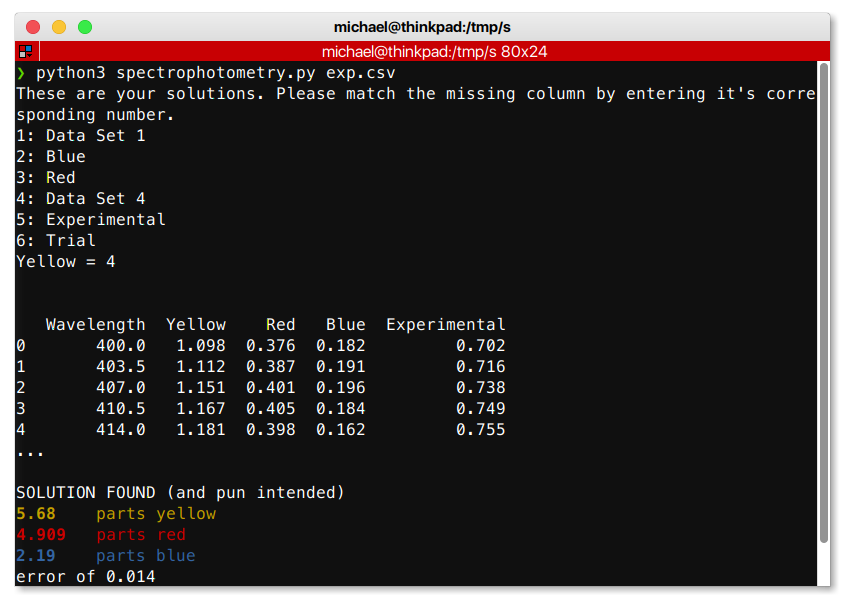

# Spectrophotometry.py: A spectral analysis program for AP Chem
To determine the composition of a mystery mixture consisting of various types of food coloring, I wrote this program that works with Vernier's Spectral Analysis software. It will determine the ratio between the concentrations of yellow, red, and blue are in the mystery solution given four spectrophotograms: a yellow, a red, a blue, and the mystery one.

One limitation of the program is that the wavelength values need to line up across the CSV table- thus all the data used must be collected at the same time.

To modify this program for use in other situations, the hard-coded maximum concentration variable could be changed. Further updates to the script could make it more generalized by allowing the use of a command-line flag to change this value.

## Installation
1. Download the script from my Github page [here](https://github.com/michaelnoguera/spectrophotometry).
```bash
$ git clone https://github.com/michaelnoguera/spectrophotometry.git
```
2. Install any unsatisfied dependencies. This project is written in Python 3, and requires `pandas` and `scipy`.
```bash
$ pip install -r requirements.txt # might need to use "pip3" depending on how your system is set up
```

## Usage
```
spectrophotometry.py by Michael Noguera

        Finds the ratio of the components in a color mixture based on their spectrophotograms, 
        based on the LM-BFGS-B algorithm for optimizing a multi-variable system.

Usage:
        `python spectrophotometry.py data_file.csv`

        The csv file should be in the format exported from the Vernier Spectral Analysis app.

Options:
        -h      displays this message and exits
```
1. Run the script in the terminal, providing your CSV export from Spectral Analysis as the first argument.

```bash
$ python spectrophotometry.py data_file.csv
```
2. If needed, follow the prompts in the program to pair up your absorbance columns with the different colors.


3. The relative concentrations will be printed directly to `stdout`. You can always pipe the output into a file as follows:

```bash
python spectrophotometry.py data_file.csv > output.txt
```

## Notes
- You don't have to use Vernier Spectral Analysis in order to use this. The input format is as follows, where
each sample gets a column for wavelength followed by one for absorbance. All columns in the file must have the
same length.
```csv
Data Set 1:Wavelength(nm),Data Set 1:Absorbance,Blue:Wavelength(nm),Blue:Absorbance,Red:Wavelength(nm),Red:Absorbance,Data Set 4:Wavelength(nm),Data Set 4:Absorbance,Mystery 3:Wavelength(nm),Mystery 3:Absorbance,Trial:Wavelength(nm),Trial:Absorbance
400.0,0.001,400.0,0.182,400.0,0.376,400.0,1.098,400.0,0.702,400.0,0.733
403.5,0.001,403.5,0.191,403.5,0.387,403.5,1.112,403.5,0.716,403.5,0.747
407.0,0.000,407.0,0.196,407.0,0.401,407.0,1.151,407.0,0.738,407.0,0.772
410.5,0.000,410.5,0.184,410.5,0.405,410.5,1.167,410.5,0.749,410.5,0.784
414.0,0.000,414.0,0.162,414.0,0.398,414.0,1.181,414.0,0.755,414.0,0.785
417.5,0.000,417.5,0.139,417.5,0.390,417.5,1.181,417.5,0.757,417.5,0.779
421.0,0.000,421.0,0.120,421.0,0.389,421.0,1.190,421.0,0.761,421.0,0.775
424.5,0.001,424.5,0.107,424.5,0.395,424.5,1.196,424.5,0.765,424.5,0.776
428.0,0.001,428.0,0.097,428.0,0.402,428.0,1.192,428.0,0.766,428.0,0.776
```